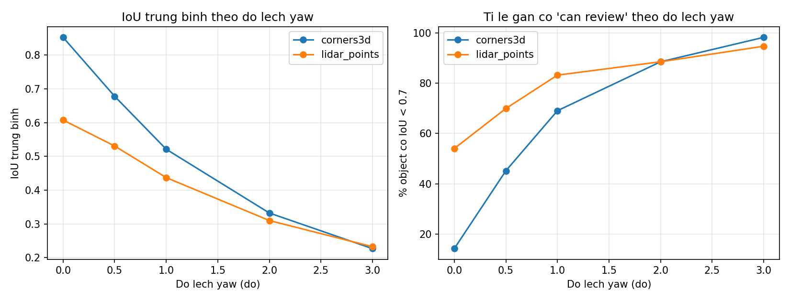
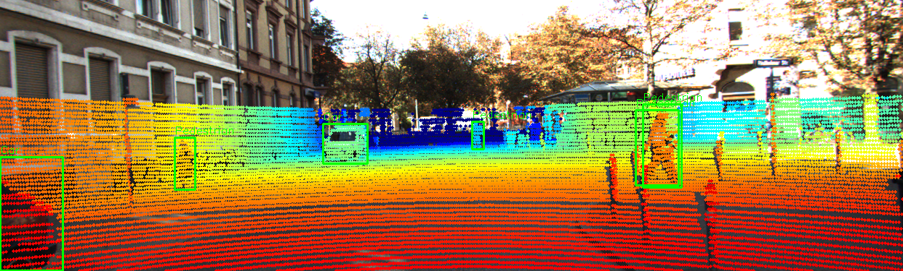

# Báo cáo Day 6: Hỗ trợ gán nhãn 2D bằng LiDAR (topic F)

> Thay **mọi** ô có chữ ĐIỀN nằm trong ngoặc vuông bằng nội dung của bạn, xoá luôn cả dấu ngoặc vuông. Lệnh `python tools/check_submission.py` sẽ báo FAIL nếu còn sót bất kỳ chỗ nào.

- **Họ tên:** Phùng Quang Minh Huy
- **MSSV:** 2A202602610
- **Lớp:** AI20K — Track 4 (Computer Vision and Robotics)
- **Link repo:** https://github.com/huy20/PhungQuangMinhHuy-2A202602610-Track4-Day21
- **Topic:** F — Hỗ trợ gán nhãn bằng LiDAR (auto-label support)
- **Dataset:** data/synthetic (debug code), data/kitti_mini (thí nghiệm chính)
- **Các frame đã dùng:** synthetic 000000 (debug code); toàn bộ 20 frame của `data/kitti_mini` (000001, 000004, 000007, 000008, 000009, 000010, 000011, 000012, 000015, 000016, 000019, 000021, 000023, 000025, 000031, 000032, 000043, 000048, 000049, 000061) cho benchmark

> Hãy viết ngắn: mỗi mục từ 3 đến 8 dòng, ưu tiên số liệu và hình ảnh.

## 1. Claim

**Claim (đã kiểm chứng ở CP3):** Trên 20 frame `data/kitti_mini` ở **calibration gốc**, box 2D dựng từ **8 góc 3D box GT** đạt **IoU trung bình 0.85** (median 0.97), cao hơn hẳn box dựng từ **điểm LiDAR nằm trong 3D box** (0.61). Chỉ lệch **yaw 1°** đã làm IoU trung bình **giảm > 0.10** ở cả hai cách (0.85→0.52 và 0.61→0.44) và đẩy **tỉ lệ object có IoU < 0.7 lên 69% / 83%**, nên **ngưỡng IoU 0.7** đủ phát hiện calibration drift từ 1° trở lên.

**Diễn giải đo gì – trên frame nào – với mức nào:**
- **Đo:** IoU giữa box 2D gợi ý và box 2D GT (`label_2`), theo từng object rồi lấy trung bình mỗi cấu hình.
- **So sánh 2 cách:** (A) chiếu 8 góc 3D box (`box3d_corners_cam`) vs (B) min/max điểm LiDAR đã chiếu nằm trong 3D box.
- **Mức thay đổi:** calibration yaw ∈ {0°, 0.5°, 1°, 2°, 3°} (mỗi lần chỉ đổi 1 yếu tố, các yếu tố khác cố định).
- **Frames:** cả 20 frame `data/kitti_mini`; debug trên `data/synthetic/000000`.

## 2. Evidence

**Thí nghiệm:** so box 2D gợi ý với box 2D GT trên 113 object (Car/Pedestrian/Cyclist/Van/Truck), 20 frame `data/kitti_mini`, sweep yaw 0–3°.

Số liệu đầy đủ: `results/auto_label_iou_summary.csv` (theo cấu hình) và `results/auto_label_iou_per_object.csv` (từng object). Tái lập: `python src/auto_label_iou.py` cho đúng cùng số (đã chạy 2 lần giống nhau; phép đo tất định, `--seed 0`).

| Yaw (độ) | A: corners3d mean IoU | A: % IoU < 0.7 | B: lidar_points mean IoU | B: % IoU < 0.7 |
|---|---|---|---|---|
| 0.0 | **0.853** | 14.2 | 0.608 | 54.0 |
| 0.5 | 0.678 | 45.1 | 0.531 | 69.9 |
| 1.0 | 0.521 | 69.0 | 0.437 | 83.2 |
| 2.0 | 0.332 | 88.5 | 0.310 | 88.5 |
| 3.0 | 0.227 | 98.2 | 0.232 | 94.7 |

(n = 113 object mỗi cấu hình.)



**Nhận xét:** (1) Ở calibration gốc cách A tốt hơn hẳn cách B (0.85 vs 0.61) — khác giả định ban đầu ở CP1. Lý do: 3D box GT nhất quán với 2D annotation và phủ toàn bộ object, còn điểm LiDAR chỉ phủ bề mặt nhìn thấy, thưa và thiếu với object xa/bị che. (2) Cả hai giảm đơn điệu theo yaw; cách A nhạy hơn (mất ~0.33 IoU ở 1°) vì cả 8 góc dịch cùng lúc. (3) Tỉ lệ `IoU < 0.7` vượt 40% ngay ở 0.5° và >65% ở 1° → ngưỡng 0.7 cảnh báo sớm được drift ≥ 1°.

Ảnh demo overlay (calibration gốc, CP2): 

## 3. Failure case

Nêu khi nào hệ thống hoặc phương pháp fail, vì sao fail, và liên hệ tới lớp nào trong 6 lớp debug: I/O, Geometry, Time, Preprocess, Model, Metric.


[ĐIỀN]

## 4. Khuyến nghị nếu triển khai thật

Use-case cụ thể (ADAS / robot / drone), trade-off và bước tiếp theo.

[ĐIỀN]

## 5. Cách chạy lại

Các lệnh tái tạo lại toàn bộ kết quả từ repo sạch.

```bash
# CP2 - demo đầu tiên (sau khi đã viết 2 hàm TODO(CP2) trong starter/projection.py)
python -m starter.projection --data-root data/synthetic --frame 000000
python -m starter.projection --data-root data/kitti_mini --frame 000011
python -m starter.projection --data-root data/nuscenes_mini_subset --frame scene-0103_010
# ảnh overlay lưu vào results/figures/overlay_<frame>_*.png

# CP3 - benchmark chính: IoU 2D box gợi ý vs GT, sweep yaw 0/0.5/1/2/3 do
python src/auto_label_iou.py --data-root data/kitti_mini
# -> results/auto_label_iou_summary.csv, results/auto_label_iou_per_object.csv,
#    results/figures/auto_label_iou_vs_yaw.png
```

## 6. Khai báo sử dụng AI

Ghi rõ đã dùng công cụ AI nào, dùng vào việc gì, và bạn đã tự kiểm chứng kết quả đó bằng cách nào. Nếu không dùng AI, ghi "Không sử dụng". Xem quy định ở `RULES.md` mục 2.

| Công cụ | Dùng cho việc gì | Bạn đã kiểm chứng thế nào |
|---|---|---|
| [ĐIỀN] | | |
