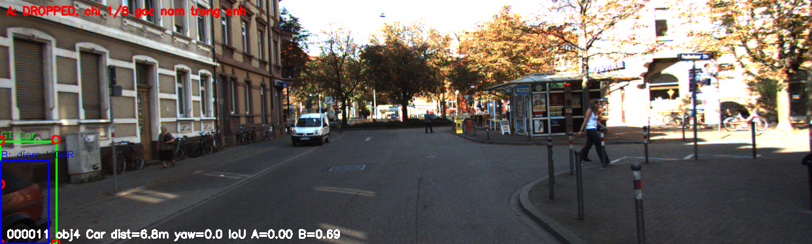
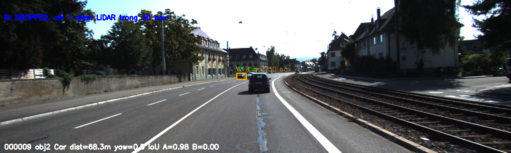

# Báo cáo Day 6: Hỗ trợ gán nhãn 2D bằng LiDAR (topic F)

> Thay **mọi** ô có chữ ĐIỀN nằm trong ngoặc vuông bằng nội dung của bạn, xoá luôn cả dấu ngoặc vuông. Lệnh `python tools/check_submission.py` sẽ báo FAIL nếu còn sót bất kỳ chỗ nào.

- **Họ tên:** Phùng Quang Minh Huy
- **MSSV:** 2A202602610
- **Lớp:** AI20K — Track 4 (Computer Vision and Robotics)
- **Link repo:** https://github.com/huy20/PhungQuangMinhHuy-2A202602610-Track4-Day21
- **Topic:** F — Hỗ trợ gán nhãn bằng LiDAR (auto-label support)
- **Dataset:** data/synthetic (debug code), data/kitti_mini (thí nghiệm chính)
- **Các frame đã dùng:** synthetic 000000 (debug code); toàn bộ 20 frame của `data/kitti_mini` (000001, 000004, 000007, 000008, 000009, 000010, 000011, 000012, 000015, 000016, 000019, 000021, 000023, 000025, 000031, 000032, 000043, 000048, 000049, 000061) cho benchmark

> Hãy viết ngắn: mỗi mục từ 3 đến 8 dòng, ưu tiên số liệu và hình ảnh.

## 1. Claim

**Claim (đã kiểm chứng ở CP3):** Trên 20 frame `data/kitti_mini` ở **calibration gốc**, box 2D dựng từ **8 góc 3D box GT** đạt **IoU trung bình 0.85** (median 0.97), cao hơn hẳn box dựng từ **điểm LiDAR nằm trong 3D box** (0.61). Chỉ lệch **yaw 1°** đã làm IoU trung bình **giảm > 0.10** ở cả hai cách (0.85→0.52 và 0.61→0.44) và đẩy **tỉ lệ object có IoU < 0.7 lên 69% / 83%**, nên **ngưỡng IoU 0.7** đủ phát hiện calibration drift từ 1° trở lên.

**Diễn giải đo gì – trên frame nào – với mức nào:**
- **Đo:** IoU giữa box 2D gợi ý và box 2D GT (`label_2`), theo từng object rồi lấy trung bình mỗi cấu hình.
- **So sánh 2 cách:** (A) chiếu 8 góc 3D box (`box3d_corners_cam`) vs (B) min/max điểm LiDAR đã chiếu nằm trong 3D box.
- **Mức thay đổi:** calibration yaw ∈ {0°, 0.5°, 1°, 2°, 3°} (mỗi lần chỉ đổi 1 yếu tố, các yếu tố khác cố định).
- **Frames:** cả 20 frame `data/kitti_mini`; debug trên `data/synthetic/000000`.

## 2. Evidence

**Thí nghiệm:** so box 2D gợi ý với box 2D GT trên 113 object (Car/Pedestrian/Cyclist/Van/Truck), 20 frame `data/kitti_mini`, sweep yaw 0–3°.

Số liệu đầy đủ: `results/auto_label_iou_summary.csv` (theo cấu hình) và `results/auto_label_iou_per_object.csv` (từng object). Tái lập: `python src/auto_label_iou.py` cho đúng cùng số (đã chạy 2 lần giống nhau; phép đo tất định, `--seed 0`).

| Yaw (độ) | A: corners3d mean IoU | A: % IoU < 0.7 | B: lidar_points mean IoU | B: % IoU < 0.7 |
|---|---|---|---|---|
| 0.0 | **0.853** | 14.2 | 0.608 | 54.0 |
| 0.5 | 0.678 | 45.1 | 0.531 | 69.9 |
| 1.0 | 0.521 | 69.0 | 0.437 | 83.2 |
| 2.0 | 0.332 | 88.5 | 0.310 | 88.5 |
| 3.0 | 0.227 | 98.2 | 0.232 | 94.7 |

(n = 113 object mỗi cấu hình.)


**Nhận xét:** (1) Ở calibration gốc cách A tốt hơn hẳn cách B (0.85 vs 0.61) — khác giả định ban đầu ở CP1. Lý do: 3D box GT nhất quán với 2D annotation và phủ toàn bộ object, còn điểm LiDAR chỉ phủ bề mặt nhìn thấy, thưa và thiếu với object xa/bị che. (2) Cả hai giảm đơn điệu theo yaw; cách A nhạy hơn (mất ~0.33 IoU ở 1°) vì cả 8 góc dịch cùng lúc. (3) Tỉ lệ `IoU < 0.7` vượt 40% ngay ở 0.5° và >65% ở 1° → ngưỡng 0.7 cảnh báo sớm được drift ≥ 1°.

Ảnh demo overlay (calibration gốc, CP2): 

## 3. Failure case

Tìm được **2 failure case bù trừ nhau** — không cách nào robust một mình: cách A (8 góc) fail với vật gần/bị cắt ở rìa ảnh, cách B (điểm LiDAR) fail với vật xa. Trong ảnh: GT (xanh lá), A (cam), B (xanh dương).

**Fail 01 — 000011 obj4 (Car, 6.8 m): A bị bỏ, B vẫn dùng được.**

- **Khi nào:** vật rất gần và bị cắt ở rìa ảnh; 2D box GT = `[0, 217, 86, 374]` chạm biên trái và đáy. Cả 8 góc 3D box đều nằm trước camera (z>0) nhưng chỉ **1/8 góc** chiếu vào trong ảnh; cách A cần ≥4 góc trong ảnh nên bị **bỏ (valid=0 → IoU 0)**, trong khi B từ 3251 điểm LiDAR vẫn đạt IoU 0.69.
- **Vì sao:** vật gần làm các góc box chiếu ra ngoài khung (một phần box ngoài FOV / sau biên). Điều kiện "≥4 góc nằm trong ảnh" của A sai với vật truncated.
- **Lớp debug:** **Geometry** (truncation/FOV — box chiếu ra ngoài rìa), kèm yếu tố **Metric** (ngưỡng đếm góc là quy tắc đo của mình, không phải lỗi dữ liệu).
- **Phát hiện/khắc phục:** dùng cờ `truncated`/`occluded` trong label và kiểm tra box so với biên ảnh; với vật chạm biên, clip box theo ảnh rồi fallback sang điểm LiDAR, hoặc hạ điều kiện còn ≥2 góc. Log cờ "truncated" để reviewer xem tay.

**Fail 02 — 000009 obj2 (Car, 68.3 m): A tốt, B bị bỏ.**

- **Khi nào:** vật xa 68 m, 2D box chỉ 23×15 px; chỉ **1 điểm LiDAR** rơi trong 3D box (cần ≥2) nên B bị **bỏ (IoU 0)**, còn A đạt IoU 0.98.
- **Vì sao:** mật độ điểm giảm theo bình phương khoảng cách; LiDAR 64 tia không đủ điểm trên vật nhỏ/xa. Lớp **Preprocess** (mật độ điểm/range — bước chọn điểm hết dữ liệu), có phần **Geometry** (tiêu chí "điểm trong 3D box" quá chặt khi box nhỏ).
- **Phát hiện/khắc phục:** ngưỡng theo khoảng cách — object > ~50 m thì chuyển sang cách A, hoặc gộp điểm lân cận (dilate box); ghi log số điểm/box theo range để biết khi nào B không đáng tin.

**Bài học chung:** dùng A làm mặc định, chỉ chuyển sang B khi đủ điểm (hoặc để B QA A); luôn gắn cờ object truncated/xa thay vì tin hoàn toàn box tự động. Lệnh tạo ảnh: `python src/make_failure_figure.py --frame 000011 --obj-index 4 --out results/figures/fail_01_near_object_truncated.png` (tương tự cho fail 02, `--frame 000009 --obj-index 2`).

## 4. Khuyến nghị nếu triển khai thật

Use-case cụ thể (ADAS / robot / drone), trade-off và bước tiếp theo.

[ĐIỀN]

## 5. Cách chạy lại

Các lệnh tái tạo lại toàn bộ kết quả từ repo sạch.

```bash
# CP2 - demo đầu tiên (sau khi đã viết 2 hàm TODO(CP2) trong starter/projection.py)
python -m starter.projection --data-root data/synthetic --frame 000000
python -m starter.projection --data-root data/kitti_mini --frame 000011
python -m starter.projection --data-root data/nuscenes_mini_subset --frame scene-0103_010
# ảnh overlay lưu vào results/figures/overlay_<frame>_*.png

# CP3 - benchmark chính: IoU 2D box gợi ý vs GT, sweep yaw 0/0.5/1/2/3 do
python src/auto_label_iou.py --data-root data/kitti_mini
# -> results/auto_label_iou_summary.csv, results/auto_label_iou_per_object.csv,
#    results/figures/auto_label_iou_vs_yaw.png

# CP4 - ve 2 anh failure case
python src/make_failure_figure.py --frame 000011 --obj-index 4 --out results/figures/fail_01_near_object_truncated.png
python src/make_failure_figure.py --frame 000009 --obj-index 2 --out results/figures/fail_02_far_object_no_points.png
```

## 6. Khai báo sử dụng AI

Ghi rõ đã dùng công cụ AI nào, dùng vào việc gì, và bạn đã tự kiểm chứng kết quả đó bằng cách nào. Nếu không dùng AI, ghi "Không sử dụng". Xem quy định ở `RULES.md` mục 2.

| Công cụ | Dùng cho việc gì | Bạn đã kiểm chứng thế nào |
|---|---|---|
| [ĐIỀN] | | |
